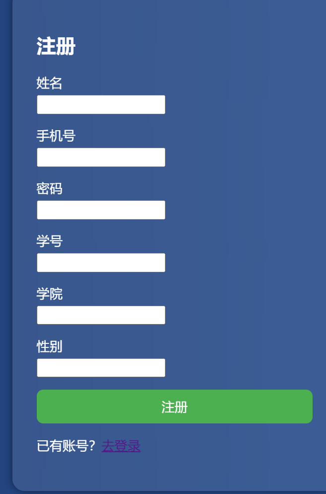
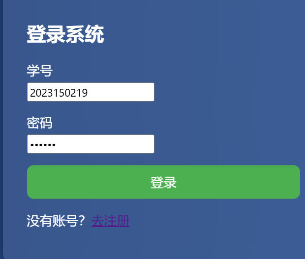
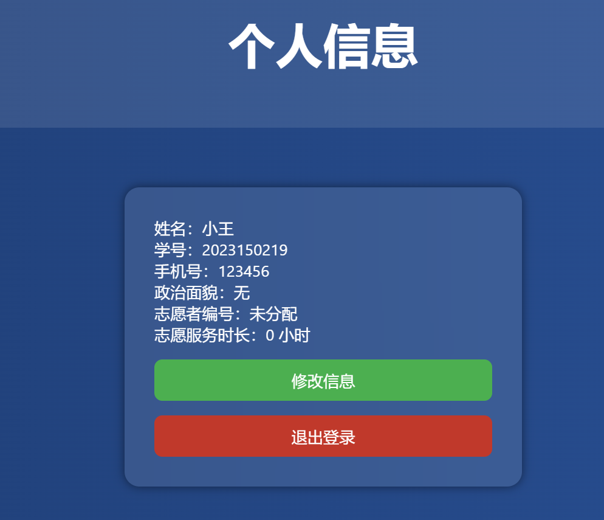
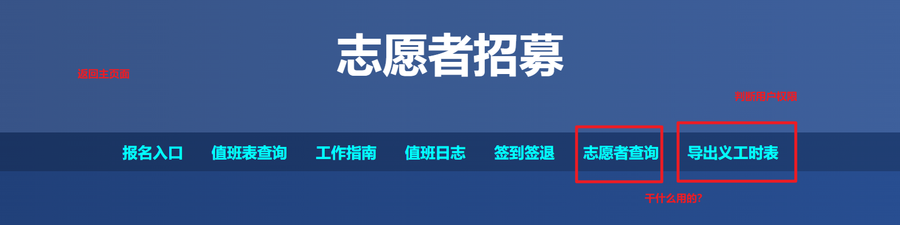
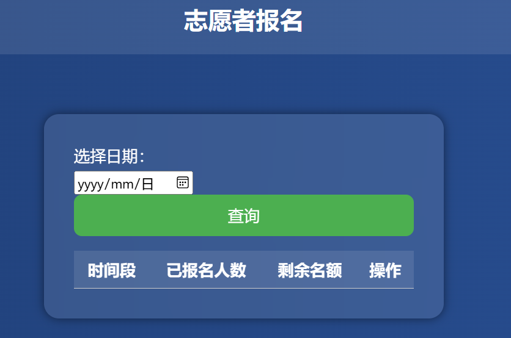
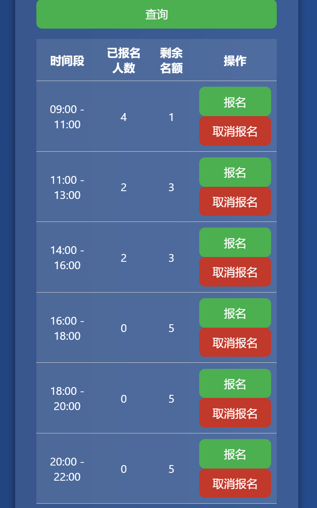
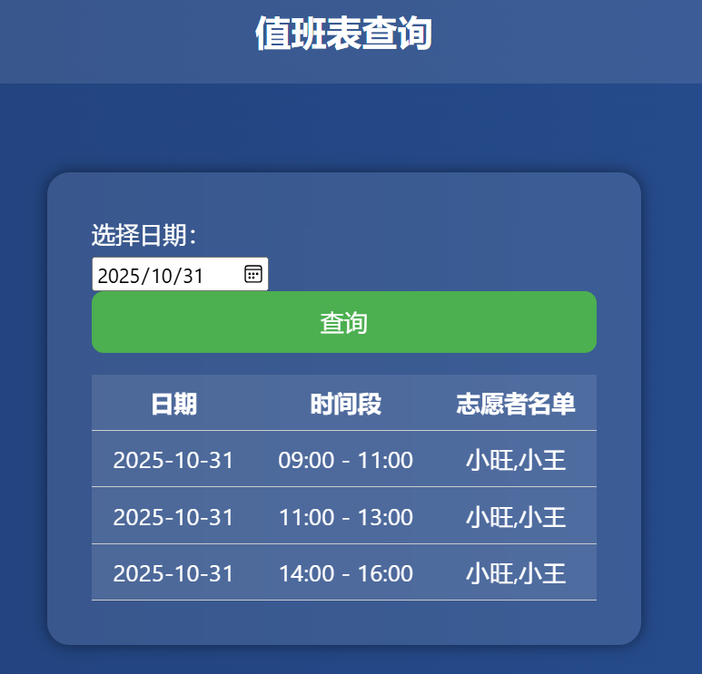
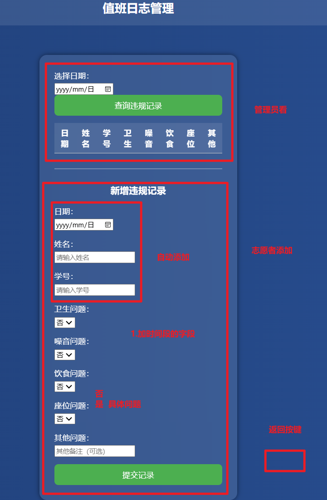
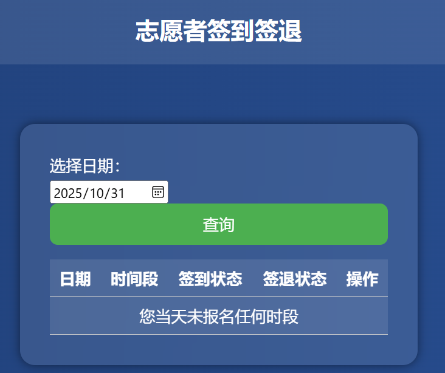

### 1

再次确认密码 设置强度....

差一个义工号 、 政治身份、年级、教育背景

### 2

框拉长、铺满

### 3

安全问题  没登陆直接修改url进入其他页面怎么处理

### 4

返回主页面 按钮   显示完整信息

### 5

密码 hash加密

### 6

添加所有页面的返回按钮  退出登录

### 7

先显示当天
日期限制 

### 8

时间段需要修改 名额为3个人

### 9

先显示今天的   返回按钮

### 10

静态内容

### 11

### 12

签到签退时间限制

## 后端

判断时间能否报名  有没有过了

~~不能重复报名同一时间段&人数不超过三个~~ 

签到签退 未签到不能签退  判断时间（前端能做 但是怕改时间）

~~导出义工时表~~ 
~~开始日期  结束日期~~

